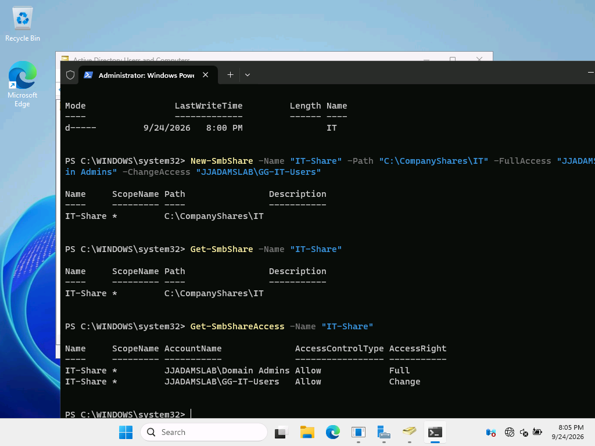
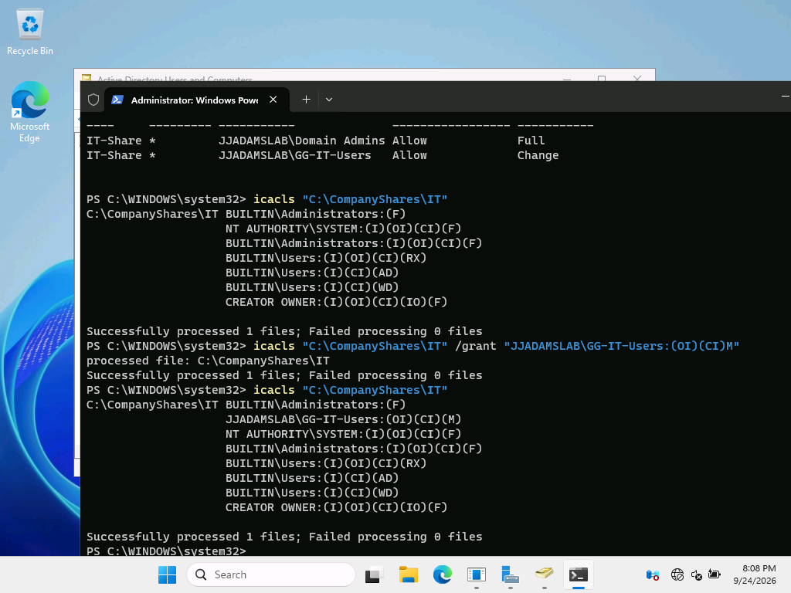
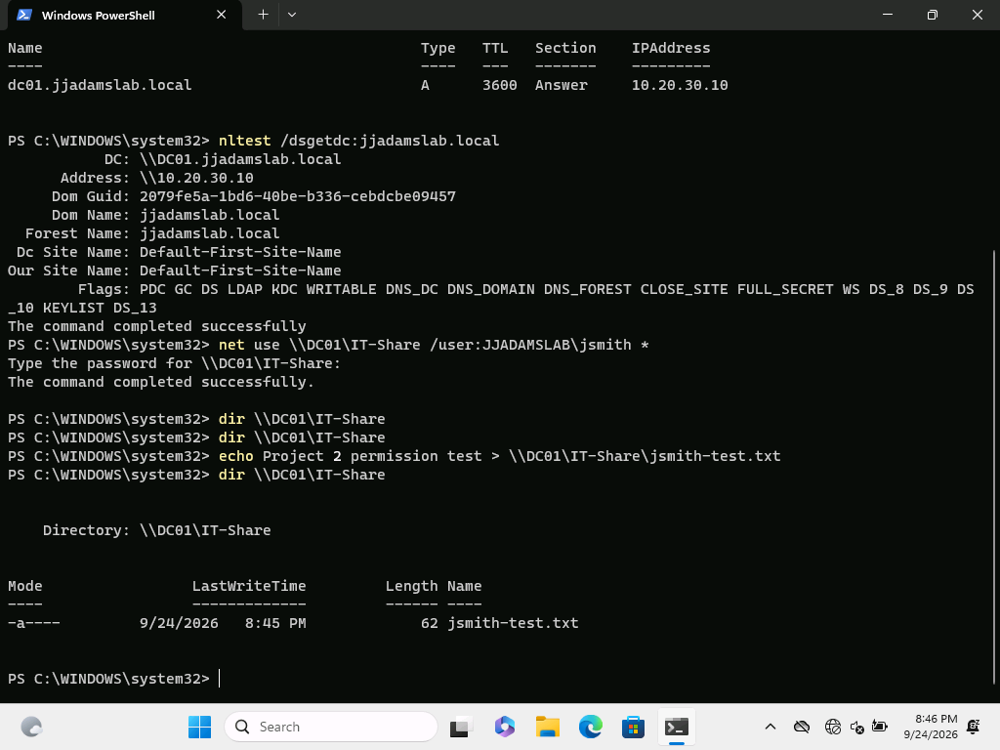
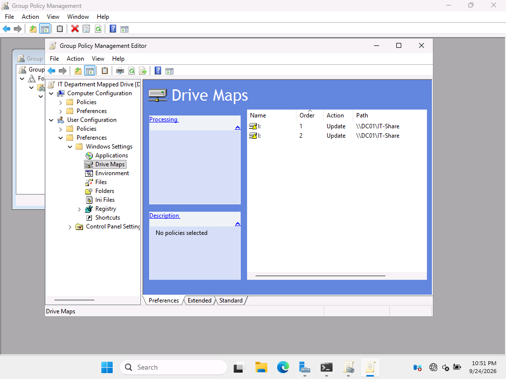
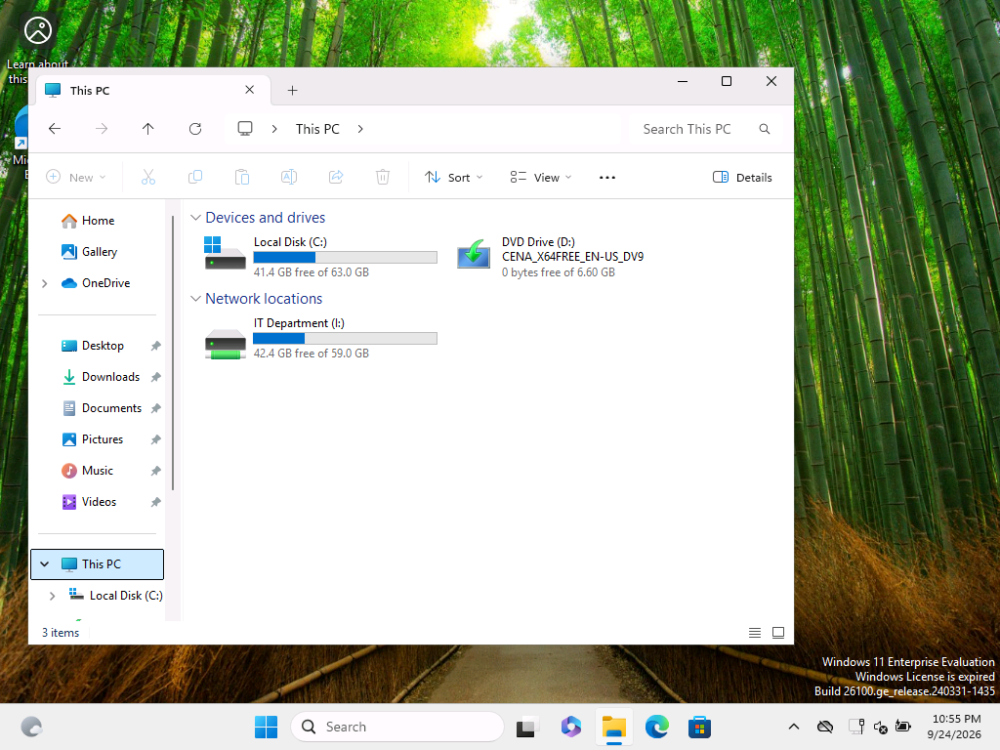
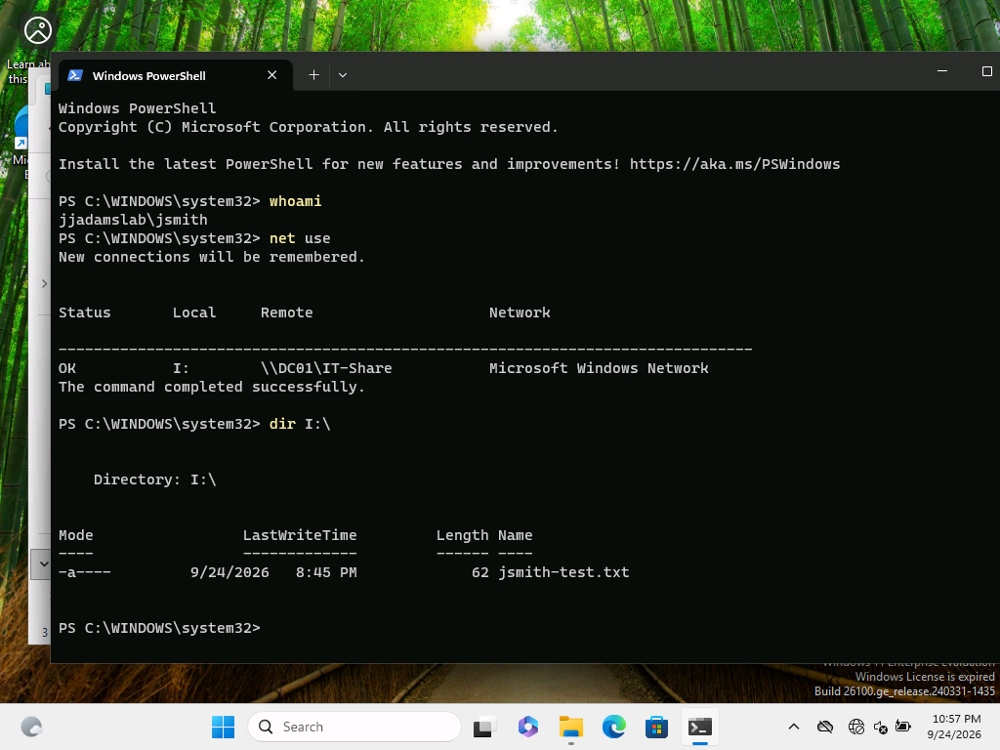

# Phase 2: Departmental File Share and Mapped Drive with Group Policy

In this phase I built on the domain from [Phase 1](../README.md) to handle a request that IT support teams see all the time. A user in the IT department needs secure access to the department's file share, and the share should show up on their machine as a mapped drive without anyone setting it up by hand.

This is a home lab, not a production environment. I built it to practice the file server and Group Policy work that IT Support, Desktop Support, and Junior Systems Administrator roles handle every day.

## The Environment

| System | Role | Domain |
|---|---|---|
| DC01 | Windows Server 2025 domain controller, DNS, and file server | jjadamslab.local |
| C01 | Windows 11 Enterprise domain workstation | jjadamslab.local |

Both VMs run on Hyper-V. The test user is James Smith (jsmith), a member of the GG-IT-Users global security group.

**Final result:** `JJADAMSLAB\jsmith` signs in to C01 and gets the `I:` drive mapped to `\\DC01\IT-Share` automatically, with Status OK.

## How I Built It

1. Created the `C:\CompanyShares\IT` folder on DC01 and published it as the `IT-Share` SMB share. Domain Admins got Full access and GG-IT-Users got Change access at the share level.
2. Granted GG-IT-Users Modify rights on the folder through NTFS, so access follows group membership instead of individual accounts.
3. Signed in on C01, confirmed it could locate the domain controller, connected to the share as jsmith, and wrote a test file to prove write access.
4. Created the IT Department Mapped Drive GPO and used Group Policy Preferences to map `\\DC01\IT-Share` as the `I:` drive, labeled IT Department.
5. Ran a policy refresh, signed in again as jsmith, and confirmed the drive appeared in File Explorer on its own.
6. Verified the whole chain with `whoami`, `net use`, and a listing of `I:\`.

The commands I ran are in [commands.ps1](commands.ps1).

## What Went Wrong and What I Learned

**C01 had dropped out of the domain.** Partway through testing, domain sign in and user policy processing stopped working. The cause was that C01 was no longer joined to jjadamslab.local. Rejoining it brought back domain authentication and Group Policy processing. Now I check domain membership and `nltest /dsgetdc` early whenever a domain user runs into problems.

**The mapped drive would not appear.** A manual `net use` to the share worked fine, which proved the share, the share permissions, and NTFS were all correct. That narrowed the problem down to Group Policy Preferences. Inside the GPO I found two `I:` Drive Maps entries pointing at the same share. After I removed the duplicate, the drive deployed on the next sign in.

The bigger lesson: test the lower layer by hand first. Once the manual connection worked, I knew exactly which layer to look at.

## Screenshots

### 1. IT SMB share created
`New-SmbShare` publishes `C:\CompanyShares\IT` as IT-Share, and `Get-SmbShareAccess` shows Full for Domain Admins and Change for GG-IT-Users.

### 2. NTFS Modify for GG-IT-Users
`icacls` before and after granting `JJADAMSLAB\GG-IT-Users:(OI)(CI)M` on the folder.

### 3. Domain user access test from C01
`nltest` finds DC01, jsmith connects to the share, and `jsmith-test.txt` gets written to it.

### 4. Group Policy Preferences drive map
The IT Department Mapped Drive GPO maps `\\DC01\IT-Share` as `I:`. This capture still shows the duplicate entry I later removed.

### 5. Drive mapped automatically
After a policy refresh and a new sign in, IT Department (I:) appears under Network locations on C01.

### 6. Final end to end verification
`whoami` returns jjadamslab\jsmith, `net use` shows `I:` on `\\DC01\IT-Share` with Status OK, and `I:\` lists the test file.

## Documentation

[Step by step evidence (PDF)](Phase2_File_Share_Drive_Map_Evidence.pdf)

## Skills This Phase Shows

Windows Server file services, SMB shares, share and NTFS permissions, group based access control, Group Policy Preferences drive mapping, domain client troubleshooting, PowerShell, and technical documentation.

## What's Next

Separate IT, HR, and Sales shares, each with its own security group and least privilege NTFS permissions, their own mapped drives, and tests to confirm users cannot reach other departments' shares.

## A Note on Security

This is an isolated lab with made up users. The repository contains no passwords or credentials.
